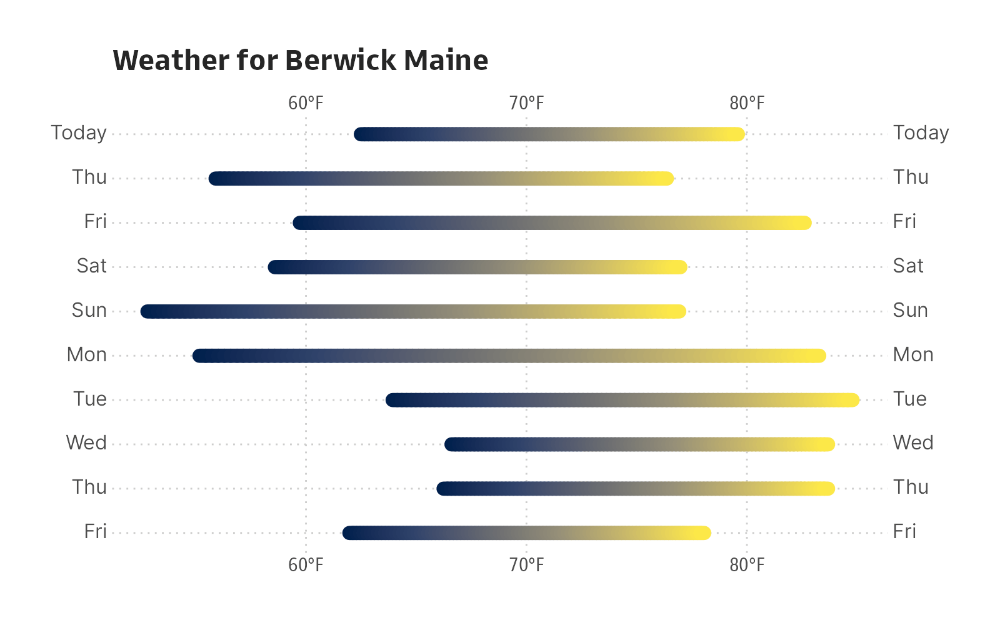

[](https://www.repostatus.org/#active)
[](https://keybase.io/hrbrmstr)

[](https://github.com/hrbrmstr/weatherkit/actions?query=workflow%3AR-CMD-check)
[](https://travis-ci.org/hrbrmstr/weatherkit)
[](https://codecov.io/gh/hrbrmstr/weatherkit)


# weatherkit

Obtain Historical, Current, and Predictive Weather Data

## Description

Apple’s WeatherKit REST API
(<https://developer.apple.com/documentation/weatherkit>) provides timely
weather information including current conditions, minute precipitation,
along with hourly, and daily forecasts. It also provides severe weather
alerts. Tools are provided to obtain historical, current, and predictive
weather data. Also includes a set of weather icons by Erik Flowers.

## What’s Inside The Tin

The following functions are implemented:

-   `anydate`: Parse POSIXct or Date objects from input data
-   `anytime`: Parse POSIXct or Date objects from input data
-   `apple_weather_trademark`: The Apple Weather Required Trademark
-   `celsius_to_fahrenheit`: Convert from Celsius to Fahrenheit
-   `command_line_forecast_script`: Command Line Forecast Script
-   `condition_codes`: Condition Codes
-   `convert_wind_speed`: Convert between wind speed metrics
-   `coordinates_from_ip`: Get latitude and longitude coordinates from
    your/an IP address
-   `current_conditions`: Function to display current conditions for a
    given weather data retrieval
-   `daily_forecast`: Function to display daily forecast for a given
    weather data retrieval
-   `dewpoint_to_humidity`: Calculate relative humidity
-   `fahrenheit_to_celsius`: Convert from Fahrenheit to Celsius
-   `hourly_forecast`: Function to display hourly forecast for a given
    weather data retrieval
-   `humidity_to_dewpoint`: Calculate dew point temperature
-   `inches_to_metric`: Convert from inches to standard metric units of
    measure for precipitation
-   `iso8601`: Format a Datetime object: ISO 8601
-   `meters_to_miles`: Convert meters to miles
-   `metric_to_inches`: Convert between standard metric units of measure
    for precipitation to inches
-   `precip_type`: Converts precipitationType string values to symbols
-   `pressure_trend`: Converts pressureTrend string values to symbols
-   `readable_conditions`: Turns Apple’s smushed together condition code
    strings into proper words/phrases
-   `seq_rng`: Create a sequence from a value range
-   `uv_label`: UV index to label
-   `wind_direction_label`: Converts wind direction angle to the
    corresponding value of the 16-wind compass rose composed of the
    cardinal directions—north, east, south, and west—and its
    intercardinal directions
-   `with_tz`: Get date-time in a different time zone
-   `wx_icons_path`: Returns the full path to the installed SVG weather
    icons
-   `wx_icons_preview`: Preview the included SVG weather icons
-   `wx_tidy`: Tidy values in weather data
-   `wxkit_alert`: Receive an active weather alert.
-   `wxkit_auth`: Authentication components necessary for creation of
    JSON Web Tokens
-   `wxkit_availability`: Determine the data sets available for the
    specified location.
-   `wxkit_weather`: Obtain weather data for the specified location.

## Installation

``` r
remotes::install_github("hrbrmstr/weatherkit")
```

NOTE: To use the ‘remotes’ install options you will need to have the
[{remotes} package](https://github.com/r-lib/remotes) installed.

## NOTE

Please reference the local [Authorization](authorization.md)
documentation or use `vignette("authorization", package="weatherkit")`
at an R console for information on how to obtain the necessary
authentication and signing components required to use the WeatherKit
REST API from this package.

If your apps, web apps, or websites display any Apple weather data
(other than weather alerts or value-added services or products, as
described below), you must clearly display the Apple Weather trademark
( Weather), as well as the [legal link to other data
sources](https://weatherkit.apple.com/legal-attribution.html).

## Usage

``` r
library(weatherkit)
library(ragg)

# current version
packageVersion("weatherkit")
## [1] '0.2.0'
```

``` r
wxkit_availability(43.2683199, -70.8635506, "US")
## [1] "currentWeather"   "forecastDaily"    "forecastHourly"   "forecastNextHour" "weatherAlerts"
```

``` r
wx <- wxkit_weather(43.2683199, -70.8635506)
wx <- wx_tidy(wx)
str(wx)
## List of 4
##  $ currentWeather  :List of 18
##   ..$ name                  : chr "CurrentWeather"
##   ..$ metadata              :List of 8
##   .. ..$ attributionURL: chr "https://weather-data.apple.com/legal-attribution.html"
##   .. ..$ expireTime    : POSIXct[1:1], format: "2022-07-08 15:45:09"
##   .. ..$ latitude      : num 43.3
##   .. ..$ longitude     : num -70.9
##   .. ..$ readTime      : POSIXct[1:1], format: "2022-07-08 15:40:09"
##   .. ..$ reportedTime  : POSIXct[1:1], format: "2022-07-08 13:58:20"
##   .. ..$ units         : chr "m"
##   .. ..$ version       : int 1
##   ..$ asOf                  : POSIXct[1:1], format: "2022-07-08 15:40:09"
##   ..$ cloudCover            : num 0.32
##   ..$ conditionCode         : chr "MostlyClear"
##   ..$ daylight              : logi TRUE
##   ..$ humidity              : num 0.52
##   ..$ precipitationIntensity: num 0
##   ..$ pressure              : num 1013
##   ..$ pressureTrend         : chr "falling"
##   ..$ temperature           : num 27.1
##   ..$ temperatureApparent   : num 27.7
##   ..$ temperatureDewPoint   : num 16.4
##   ..$ uvIndex               : int 7
##   ..$ visibility            : num 34267
##   ..$ windDirection         : int 263
##   ..$ windGust              : num 27.7
##   ..$ windSpeed             : num 11.9
##  $ forecastDaily   :List of 3
##   ..$ name    : chr "DailyForecast"
##   ..$ metadata:List of 8
##   .. ..$ attributionURL: chr "https://weather-data.apple.com/legal-attribution.html"
##   .. ..$ expireTime    : POSIXct[1:1], format: "2022-07-08 16:40:09"
##   .. ..$ latitude      : num 43.3
##   .. ..$ longitude     : num -70.9
##   .. ..$ readTime      : POSIXct[1:1], format: "2022-07-08 15:40:09"
##   .. ..$ reportedTime  : POSIXct[1:1], format: "2022-07-08 13:58:20"
##   .. ..$ units         : chr "m"
##   .. ..$ version       : int 1
##   ..$ days    :'data.frame': 10 obs. of  26 variables:
##   .. ..$ forecastStart      : POSIXct[1:10], format: "2022-07-08 04:00:00" "2022-07-09 04:00:00" "2022-07-10 04:00:00" "2022-07-11 04:00:00" ...
##   .. ..$ forecastEnd        : POSIXct[1:10], format: "2022-07-09 04:00:00" "2022-07-10 04:00:00" "2022-07-11 04:00:00" "2022-07-12 04:00:00" ...
##   .. ..$ conditionCode      : chr [1:10] "PartlyCloudy" "MostlyClear" "Clear" "MostlyClear" ...
##   .. ..$ maxUvIndex         : int [1:10] 7 7 8 7 6 7 6 4 7 6
##   .. ..$ moonPhase          : chr [1:10] "firstQuarter" "waxingGibbous" "waxingGibbous" "waxingGibbous" ...
##   .. ..$ moonrise           : POSIXct[1:10], format: "2022-07-08 18:50:47" "2022-07-09 20:07:35" "2022-07-10 21:27:35" "2022-07-11 22:46:29" ...
##   .. ..$ moonset            : POSIXct[1:10], format: "2022-07-08 04:54:51" "2022-07-09 05:20:27" "2022-07-10 05:51:50" "2022-07-11 06:32:18" ...
##   .. ..$ precipitationAmount: num [1:10] 0 0 0 0 1.09 2.83 0.33 0.1 0 2.08
##   .. ..$ precipitationChance: num [1:10] 0.04 0.01 0 0.05 0.46 0.53 0.43 0.36 0.21 0.36
##   .. ..$ precipitationType  : chr [1:10] "clear" "clear" "clear" "clear" ...
##   .. ..$ snowfallAmount     : num [1:10] 0 0 0 0 0 0 0 0 0 0
##   .. ..$ solarMidnight      : POSIXct[1:10], format: "2022-07-08 04:48:39" "2022-07-09 04:48:49" "2022-07-10 04:48:58" "2022-07-11 04:49:06" ...
##   .. ..$ solarNoon          : POSIXct[1:10], format: "2022-07-08 16:48:35" "2022-07-09 16:48:44" "2022-07-10 16:48:53" "2022-07-11 16:49:00" ...
##   .. ..$ sunrise            : POSIXct[1:10], format: "2022-07-08 09:11:42" "2022-07-09 09:12:26" "2022-07-10 09:13:11" "2022-07-11 09:13:57" ...
##   .. ..$ sunriseCivil       : POSIXct[1:10], format: "2022-07-08 08:36:53" "2022-07-09 08:37:41" "2022-07-10 08:38:31" "2022-07-11 08:39:22" ...
##   .. ..$ sunriseNautical    : POSIXct[1:10], format: "2022-07-08 07:51:39" "2022-07-09 07:52:36" "2022-07-10 07:53:34" "2022-07-11 07:54:34" ...
##   .. ..$ sunriseAstronomical: POSIXct[1:10], format: "2022-07-08 06:56:30" "2022-07-09 06:57:46" "2022-07-10 06:59:04" "2022-07-11 07:00:25" ...
##   .. ..$ sunset             : POSIXct[1:10], format: "2022-07-09 00:25:26" "2022-07-10 00:24:59" "2022-07-11 00:24:30" "2022-07-12 00:23:59" ...
##   .. ..$ sunsetCivil        : POSIXct[1:10], format: "2022-07-09 01:00:10" "2022-07-10 00:59:38" "2022-07-11 00:59:04" "2022-07-12 00:58:29" ...
##   .. ..$ sunsetNautical     : POSIXct[1:10], format: "2022-07-09 01:45:23" "2022-07-10 01:44:42" "2022-07-11 01:43:58" "2022-07-12 01:43:12" ...
##   .. ..$ sunsetAstronomical : POSIXct[1:10], format: "2022-07-09 02:40:16" "2022-07-10 02:39:14" "2022-07-11 02:38:09" "2022-07-12 02:37:00" ...
##   .. ..$ temperatureMax     : num [1:10] 28.8 24.8 25.5 28.8 30.9 ...
##   .. ..$ temperatureMin     : num [1:10] 15.6 15 11.6 12.4 18.9 ...
##   .. ..$ daytimeForecast    :'data.frame':   10 obs. of  11 variables:
##   .. .. ..$ forecastStart      : POSIXct[1:10], format: "2022-07-08 11:00:00" "2022-07-09 11:00:00" "2022-07-10 11:00:00" "2022-07-11 11:00:00" ...
##   .. .. ..$ forecastEnd        : POSIXct[1:10], format: "2022-07-08 23:00:00" "2022-07-09 23:00:00" "2022-07-10 23:00:00" "2022-07-11 23:00:00" ...
##   .. .. ..$ cloudCover         : num [1:10] 0.48 0.31 0.06 0.35 0.67 0.45 0.65 0.77 0.38 0.58
##   .. .. ..$ conditionCode      : chr [1:10] "PartlyCloudy" "MostlyClear" "Clear" "MostlyClear" ...
##   .. .. ..$ humidity           : num [1:10] 0.56 0.55 0.46 0.51 0.6 0.66 0.68 0.67 0.54 0.59
##   .. .. ..$ precipitationAmount: num [1:10] 0 0 0 0 0 1.92 0.13 0 0 0.52
##   .. .. ..$ precipitationChance: num [1:10] 0.03 0 0 0.02 0.3 0.34 0.27 0.14 0.12 0.24
##   .. .. ..$ precipitationType  : chr [1:10] "clear" "clear" "clear" "clear" ...
##   .. .. ..$ snowfallAmount     : num [1:10] 0 0 0 0 0 0 0 0 0 0
##   .. .. ..$ windDirection      : int [1:10] 274 124 97 221 240 222 91 129 229 198
##   .. .. ..$ windSpeed          : num [1:10] 9.34 8.94 6.87 10.95 13.43 ...
##   .. ..$ overnightForecast  :'data.frame':   10 obs. of  11 variables:
##   .. .. ..$ forecastStart      : POSIXct[1:10], format: "2022-07-08 23:00:00" "2022-07-09 23:00:00" "2022-07-10 23:00:00" "2022-07-11 23:00:00" ...
##   .. .. ..$ forecastEnd        : POSIXct[1:10], format: "2022-07-09 11:00:00" "2022-07-10 11:00:00" "2022-07-11 11:00:00" "2022-07-12 11:00:00" ...
##   .. .. ..$ cloudCover         : num [1:10] 0.41 0.09 0.24 0.38 0.42 0.54 0.83 0.14 0.53 0.91
##   .. .. ..$ conditionCode      : chr [1:10] "PartlyCloudy" "Clear" "MostlyClear" "PartlyCloudy" ...
##   .. .. ..$ humidity           : num [1:10] 0.75 0.73 0.75 0.68 0.83 0.82 0.84 0.77 0.74 0.84
##   .. .. ..$ precipitationAmount: num [1:10] 0 0 0 0 1.33 0.66 0.3 0 1.54 0.02
##   .. .. ..$ precipitationChance: num [1:10] 0 0.01 0 0.1 0.33 0.34 0.29 0.09 0.14 0.29
##   .. .. ..$ precipitationType  : chr [1:10] "clear" "clear" "clear" "clear" ...
##   .. .. ..$ snowfallAmount     : num [1:10] 0 0 0 0 0 0 0 0 0 0
##   .. .. ..$ windDirection      : int [1:10] 335 333 213 215 234 18 32 271 206 216
##   .. .. ..$ windSpeed          : num [1:10] 7.83 6.46 6.53 12.27 8.08 ...
##   .. ..$ restOfDayForecast  :'data.frame':   10 obs. of  11 variables:
##   .. .. ..$ forecastStart      : POSIXct[1:10], format: "2022-07-08 15:40:09" NA NA NA ...
##   .. .. ..$ forecastEnd        : POSIXct[1:10], format: "2022-07-09 04:00:00" NA NA NA ...
##   .. .. ..$ cloudCover         : num [1:10] 0.69 NA NA NA NA NA NA NA NA NA
##   .. .. ..$ conditionCode      : chr [1:10] "MostlyCloudy" NA NA NA ...
##   .. .. ..$ humidity           : num [1:10] 0.54 NA NA NA NA NA NA NA NA NA
##   .. .. ..$ precipitationAmount: num [1:10] 0 NA NA NA NA NA NA NA NA NA
##   .. .. ..$ precipitationChance: num [1:10] 0.03 NA NA NA NA NA NA NA NA NA
##   .. .. ..$ precipitationType  : chr [1:10] "clear" NA NA NA ...
##   .. .. ..$ snowfallAmount     : num [1:10] 0 NA NA NA NA NA NA NA NA NA
##   .. .. ..$ windDirection      : int [1:10] 296 NA NA NA NA NA NA NA NA NA
##   .. .. ..$ windSpeed          : num [1:10] 10.1 NA NA NA NA ...
##  $ forecastHourly  :List of 3
##   ..$ name    : chr "HourlyForecast"
##   ..$ metadata:List of 8
##   .. ..$ attributionURL: chr "https://weather-data.apple.com/legal-attribution.html"
##   .. ..$ expireTime    : POSIXct[1:1], format: "2022-07-08 16:40:09"
##   .. ..$ latitude      : num 43.3
##   .. ..$ longitude     : num -70.9
##   .. ..$ readTime      : POSIXct[1:1], format: "2022-07-08 15:40:09"
##   .. ..$ reportedTime  : POSIXct[1:1], format: "2022-07-08 13:58:20"
##   .. ..$ units         : chr "m"
##   .. ..$ version       : int 1
##   ..$ hours   :'data.frame': 243 obs. of  20 variables:
##   .. ..$ forecastStart         : POSIXct[1:243], format: "2022-07-08 02:00:00" "2022-07-08 03:00:00" "2022-07-08 04:00:00" "2022-07-08 05:00:00" ...
##   .. ..$ cloudCover            : num [1:243] 0.08 0.03 0.01 0.02 0.15 0.8 0.81 0.01 0.05 0.04 ...
##   .. ..$ conditionCode         : chr [1:243] "Clear" "Clear" "Clear" "Clear" ...
##   .. ..$ daylight              : logi [1:243] FALSE FALSE FALSE FALSE FALSE FALSE ...
##   .. ..$ humidity              : num [1:243] 0.77 0.75 0.75 0.77 0.78 0.8 0.83 0.84 0.86 0.83 ...
##   .. ..$ precipitationAmount   : num [1:243] 0 0 0 0 0 0 0 0 0 0 ...
##   .. ..$ precipitationIntensity: num [1:243] 0 0 0 0 0 0 0 0 0 0 ...
##   .. ..$ precipitationChance   : num [1:243] 0 0 0 0 0 0 0 0 0 0 ...
##   .. ..$ precipitationType     : chr [1:243] "clear" "clear" "clear" "clear" ...
##   .. ..$ pressure              : num [1:243] 1015 1015 1015 1015 1015 ...
##   .. ..$ pressureTrend         : chr [1:243] "steady" "steady" "steady" "steady" ...
##   .. ..$ snowfallIntensity     : num [1:243] 0 0 0 0 0 0 0 0 0 0 ...
##   .. ..$ temperature           : num [1:243] 19.3 19 18.4 17.7 17.1 ...
##   .. ..$ temperatureApparent   : num [1:243] 19.6 19.1 18.4 17.7 17 ...
##   .. ..$ temperatureDewPoint   : num [1:243] 15.2 14.4 13.9 13.7 13.3 ...
##   .. ..$ uvIndex               : int [1:243] 0 0 0 0 0 0 0 0 0 1 ...
##   .. ..$ visibility            : num [1:243] 25565 26786 26538 27176 27150 ...
##   .. ..$ windDirection         : int [1:243] 160 186 179 170 167 166 171 174 177 217 ...
##   .. ..$ windGust              : num [1:243] 3.12 3.42 2.33 3.94 2.42 1.32 4.18 1.75 1.64 2.45 ...
##   .. ..$ windSpeed             : num [1:243] 3.12 2.3 0.83 1.85 1.02 0.43 2.6 1.75 0.72 1.27 ...
##  $ forecastNextHour:List of 6
##   ..$ name         : chr "NextHourForecast"
##   ..$ metadata     :List of 9
##   .. ..$ attributionURL: chr "https://weather-data.apple.com/legal-attribution.html"
##   .. ..$ expireTime    : POSIXct[1:1], format: "2022-07-08 17:40:09"
##   .. ..$ language      : chr "en-US"
##   .. ..$ latitude      : num 43.3
##   .. ..$ longitude     : num -70.9
##   .. ..$ providerName  : chr "US National Weather Service"
##   .. ..$ readTime      : POSIXct[1:1], format: "2022-07-08 15:40:09"
##   .. ..$ units         : chr "m"
##   .. ..$ version       : int 1
##   ..$ summary      :'data.frame':    1 obs. of  4 variables:
##   .. ..$ startTime             : POSIXct[1:1], format: "2022-07-08 15:41:00"
##   .. ..$ condition             : chr "clear"
##   .. ..$ precipitationChance   : num 0
##   .. ..$ precipitationIntensity: num 0
##   ..$ forecastStart: POSIXct[1:1], format: "2022-07-08 15:41:00"
##   ..$ forecastEnd  : POSIXct[1:1], format: "2022-07-08 16:57:00"
##   ..$ minutes      :'data.frame':    76 obs. of  3 variables:
##   .. ..$ startTime             : POSIXct[1:76], format: "2022-07-08 15:41:00" "2022-07-08 15:42:00" "2022-07-08 15:43:00" "2022-07-08 15:44:00" ...
##   .. ..$ precipitationChance   : num [1:76] 0 0 0 0 0 0 0 0 0 0 ...
##   .. ..$ precipitationIntensity: num [1:76] 0 0 0 0 0 0 0 0 0 0 ...
```

``` r
current_conditions(wx)
##  Weather daily forecast for (43.268, -70.864) as of 2022-07-08 11:40:09
## 
##  Conditions: Mostly Clear
## Temperature: 80.73°F
##  Feels like: 81.88°F
##   Dew Point: 61.57°F
##        Wind: 7.4 mph (W)
##    Pressure: 1013.42 mb (falling)
##  Visibility: 21 miles
##    UV Index: 🟧 7 (High)
## 
## https://weather-data.apple.com/legal-attribution.html
```

```r
# weatherAlerts structure

List of 4
 $ name      : chr "WeatherAlertCollection"
 $ metadata  :List of 9
 $ detailsUrl: chr "https://weather-data.apple.com/alertDetails/index.html?ids=55f14171-c72f-5340-8003-9b51e52d14e5&lang=en-US&time"| __truncated__
 $ alerts    :'data.frame':     1 obs. of  18 variables:
> str(y$weatherAlerts)
List of 4
 $ name      : chr "WeatherAlertCollection"
 $ metadata  :List of 9
  ..$ attributionURL: chr "https://weather-data.apple.com/legal-attribution.html"
  ..$ expireTime    : chr "2022-07-28T18:13:02Z"
  ..$ language      : chr "en-US"
  ..$ latitude      : num 43.3
  ..$ longitude     : num -70.9
  ..$ providerName  : chr "National Weather Service"
  ..$ readTime      : chr "2022-07-28T18:08:02Z"
  ..$ reportedTime  : chr "2022-07-28T18:08:02Z"
  ..$ version       : int 1
 $ detailsUrl: chr "https://weather-data.apple.com/alertDetails/index.html?ids=55f14171-c72f-5340-8003-9b51e52d14e5&lang=en-US&time"| __truncated__
 $ alerts    :'data.frame':     1 obs. of  18 variables:
  ..$ name         : chr "WeatherAlertSummary"
  ..$ id           : chr "55f14171-c72f-5340-8003-9b51e52d14e5"
  ..$ areaId       : chr "mez018"
  ..$ areaName     : chr "Interior York"
  ..$ countryCode  : chr "US"
  ..$ description  : chr "Special Weather Statement"
  ..$ effectiveTime: chr "2022-07-28T17:42:00Z"
  ..$ expireTime   : chr "2022-07-28T19:00:00Z"
  ..$ issuedTime   : chr "2022-07-28T17:42:00Z"
  ..$ detailsUrl   : chr "https://weather-data.apple.com/alertDetails/index.html?ids=55f14171-c72f-5340-8003-9b51e52d14e5&lang=en-US&time"| __truncated__
  ..$ precedence   : int 0
  ..$ severity     : chr "minor"
  ..$ source       : chr "National Weather Service"
  ..$ eventSource  : chr "US"
  ..$ urgency      : chr "expected"
  ..$ certainty    : chr "observed"
  ..$ importance   : chr "low"
  ..$ responses    :List of 1
  .. ..$ : list()
```

``` r
hourly_forecast(wx)
##  Weather daily forecast for (43.268, -70.864) as of 2022-07-08 11:40:09
## 
## Today @ 12:00 │ 🌡 81°F │ 💦 51% │ 1013 mb ↓ │ 😎 │ Partly Cloudy │ 🟧
##       @ 13:00 │ 🌡 83°F │ 💦 47% │ 1013 mb ↓ │ 😎 │ Mostly Cloudy │ 🟧
##       @ 14:00 │ 🌡 84°F │ 💦 45% │ 1012 mb ↓ │ 😎 │ Mostly Cloudy │ 🟨
##       @ 15:00 │ 🌡 83°F │ 💦 47% │ 1012 mb ↓ │ 😎 │ Mostly Cloudy │ 🟨
##       @ 16:00 │ 🌡 83°F │ 💦 47% │ 1012 mb ↓ │ 😎 │ Mostly Cloudy │ 🟨
##       @ 17:00 │ 🌡 82°F │ 💦 47% │ 1012 mb — │ 😎 │ Mostly Cloudy │ 🟩
##       @ 18:00 │ 🌡 81°F │ 💦 49% │ 1012 mb — │ 😎 │ Mostly Cloudy │ 🟩
##       @ 19:00 │ 🌡 79°F │ 💦 53% │ 1012 mb — │ 😎 │ Partly Cloudy │ 🟩
##       @ 20:00 │ 🌡 76°F │ 💦 58% │ 1013 mb ↑ │ 😎 │ Mostly Cloudy │ 🟩
##       @ 21:00 │ 🌡 73°F │ 💦 62% │ 1013 mb ↑ │ 🌕 │ Mostly Cloudy │ 🟩
##       @ 22:00 │ 🌡 70°F │ 💦 66% │ 1014 mb ↑ │ 🌕 │ Mostly Cloudy │ 🟩
##       @ 23:00 │ 🌡 69°F │ 💦 70% │ 1014 mb ↑ │ 🌕 │ Partly Cloudy │ 🟩
##   Sat @ 00:00 │ 🌡 67°F │ 💦 73% │ 1015 mb ↑ │ 🌕 │ Partly Cloudy │ 🟩
##       @ 01:00 │ 🌡 65°F │ 💦 77% │ 1015 mb ↑ │ 🌕 │ Partly Cloudy │ 🟩
##       @ 02:00 │ 🌡 63°F │ 💦 81% │ 1015 mb ↑ │ 🌕 │ Mostly Clear  │ 🟩
##       @ 03:00 │ 🌡 62°F │ 💦 84% │ 1015 mb ↑ │ 🌕 │ Mostly Clear  │ 🟩
##       @ 04:00 │ 🌡 60°F │ 💦 86% │ 1016 mb — │ 🌕 │ Mostly Clear  │ 🟩
##       @ 05:00 │ 🌡 59°F │ 💦 87% │ 1016 mb ↑ │ 🌕 │ Mostly Clear  │ 🟩
##       @ 06:00 │ 🌡 60°F │ 💦 86% │ 1017 mb ↑ │ 😎 │ Mostly Clear  │ 🟩
##       @ 07:00 │ 🌡 63°F │ 💦 81% │ 1017 mb ↑ │ 😎 │ Mostly Clear  │ 🟩
## 
## https://weather-data.apple.com/legal-attribution.html
```

``` r
daily_forecast(wx)
##  Weather daily forecast for (43.268, -70.864) as of 2022-07-08 11:40:09
## 
## Today 60° ▆▆▆▆▆▆▆▆▆▆▆▆▆▆▆▆▆▆▆▆▆▆▆▆▆▆▆▆▆▆ 84° 🟧 Partly Cloudy
##   Sat 59° ▆▆▆▆▆▆▆▆▆▆▆▆▆▆▆▆▆▆▆▆▆▆▆▆▆▆▆▆▆▆ 77° 🟧 Mostly Clear 
##   Sun 53° ▆▆▆▆▆▆▆▆▆▆▆▆▆▆▆▆▆▆▆▆▆▆▆▆▆▆▆▆▆▆ 78° 🟥 Clear        
##   Mon 54° ▆▆▆▆▆▆▆▆▆▆▆▆▆▆▆▆▆▆▆▆▆▆▆▆▆▆▆▆▆▆ 84° 🟧 Mostly Clear 
##   Tue 66° ▆▆▆▆▆▆▆▆▆▆▆▆▆▆▆▆▆▆▆▆▆▆▆▆▆▆▆▆▆▆ 88° 🟧 Drizzle      
##   Wed 66° ▆▆▆▆▆▆▆▆▆▆▆▆▆▆▆▆▆▆▆▆▆▆▆▆▆▆▆▆▆▆ 83° 🟧 Drizzle      
##   Thu 64° ▆▆▆▆▆▆▆▆▆▆▆▆▆▆▆▆▆▆▆▆▆▆▆▆▆▆▆▆▆▆ 78° 🟧 Drizzle      
##   Fri 61° ▆▆▆▆▆▆▆▆▆▆▆▆▆▆▆▆▆▆▆▆▆▆▆▆▆▆▆▆▆▆ 77° 🟨 Drizzle      
##   Sat 60° ▆▆▆▆▆▆▆▆▆▆▆▆▆▆▆▆▆▆▆▆▆▆▆▆▆▆▆▆▆▆ 81° 🟧 Partly Cloudy
##   Sun 64° ▆▆▆▆▆▆▆▆▆▆▆▆▆▆▆▆▆▆▆▆▆▆▆▆▆▆▆▆▆▆ 83° 🟧 Drizzle      
## 
## https://weather-data.apple.com/legal-attribution.html
```

``` r
library(ggtext)
library(ggforce)
library(hrbragg) # remotes::install_github("hrbrmstr/hrbragg")
library(ggplot2)
library(weatherkit)

data.frame(
  x = celsius_to_fahrenheit(wx$forecastDaily$days$temperatureMin),
  xend = celsius_to_fahrenheit(wx$forecastDaily$days$temperatureMax),
  y = as.integer(as.Date(wx$forecastDaily$days$forecastStart))
) -> xdf

xdf |>
  ggplot() +
  geom_link(
    aes(
      x, y, xend=xend, yend=y,
      colour = stat(index)
    ),
    linewidth = 4, # remotes::install_github("tidyverse/ggplot2")
    lineend = "round",
    show.legend = FALSE
  ) +
  scale_x_continuous(
    name = NULL,
    label = \(x) sprintf("%s°F", x),
    sec.axis = dup_axis()
  ) +
  scale_y_reverse(
    name = NULL,
    breaks = seq_rng(xdf$y),
    labels = \(x) {
      x <- as.Date(x, origin="1970-01-01")
      ifelse(x == Sys.Date(), "Today", strftime(x, "%a"))
    },
    sec.axis = dup_axis()
  ) +
  scale_colour_viridis_c(
    option = "cividis"
  ) +
  labs(
    title = "Weather for Berwick, Maine"
  ) +
  theme_gs(grid="XY", axis_text_size = 12) +
  theme(
    axis.title.x.top = element_blank(),
    axis.text.y.left = element_markdown(family = "Inter"),
    axis.text.y.right = element_markdown(family = "Inter"),
    panel.grid.major.x = element_line(linetype = "dotted", size = 0.5),
    panel.grid.major.y = element_line(linetype = "dotted", size = 0.5)
  )
```



## weatherkit Metrics

| Lang | \# Files |  (%) |  LoC |  (%) | Blank lines |  (%) | \# Lines |  (%) |
|:-----|---------:|-----:|-----:|-----:|------------:|-----:|---------:|-----:|
| R    |       21 | 0.40 |  595 | 0.30 |         203 | 0.35 |      443 | 0.42 |
| HTML |        1 | 0.02 |  306 | 0.15 |          35 | 0.06 |        2 | 0.00 |
| Rmd  |        2 | 0.04 |   69 | 0.03 |          45 | 0.08 |       81 | 0.08 |
| YAML |        2 | 0.04 |   35 | 0.02 |          10 | 0.02 |        2 | 0.00 |
| SUM  |       26 | 0.50 | 1005 | 0.50 |         293 | 0.50 |      528 | 0.50 |

clock Package Metrics for weatherkit

## Code of Conduct

Please note that this project is released with a Contributor Code of
Conduct. By participating in this project you agree to abide by its
terms.
