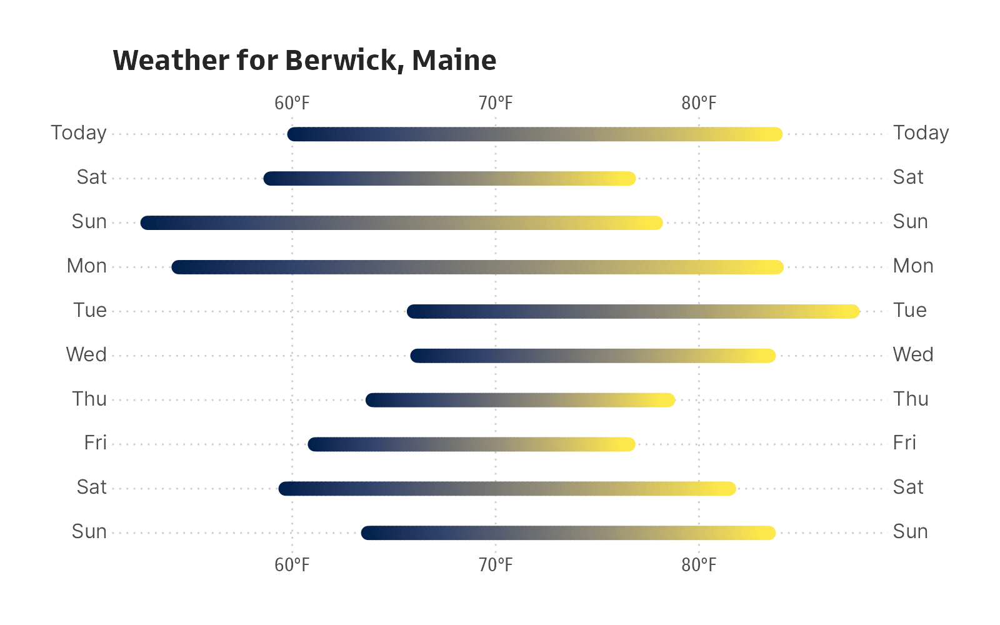

[](https://www.repostatus.org/#active)
[](https://keybase.io/hrbrmstr)

[](https://github.com/hrbrmstr/weatherkit/actions?query=workflow%3AR-CMD-check)
[](https://travis-ci.org/hrbrmstr/weatherkit)
[](https://codecov.io/gh/hrbrmstr/weatherkit)


# weatherkit

Obtain Historical, Current, and Predictive Weather Data

## Description

Apple’s WeatherKit REST API
(<https://developer.apple.com/documentation/weatherkit>) provides timely
weather information including current conditions, minute precipitation,
along with hourly, and daily forecasts. It also provides severe weather
alerts. Tools are provided to obtain historical, current, and predictive
weather data. Also includes a set of weather icons by Erik Flowers.

## What’s Inside The Tin

The following functions are implemented:

-   `anydate`: Parse POSIXct or Date objects from input data
-   `anytime`: Parse POSIXct or Date objects from input data
-   `apple_weather_trademark`: The Apple Weather Required Trademark
-   `celsius_to_fahrenheit`: Convert from Celsius to Fahrenheit
-   `condition_codes`: Condition Codes
-   `convert_wind_speed`: Convert between wind speed metrics
-   `coordinates_from_ip`: Get latitude and longitude coordinates from
    your/an IP address
-   `current_conditions`: Function to display current conditions for a
    given weather data retrieval
-   `daily_forecast`: Function to display daily forecast for a given
    weather data retrieval
-   `dewpoint_to_humidity`: Calculate relative humidity
-   `fahrenheit_to_celsius`: Convert from Fahrenheit to Celsius
-   `hourly_forecast`: Function to display hourly forecast for a given
    weather data retrieval
-   `humidity_to_dewpoint`: Calculate dew point temperature
-   `inches_to_metric`: Convert from inches to standard metric units of
    measure for precipitation
-   `iso8601`: Format a Datetime object: ISO 8601
-   `meters_to_miles`: Convert meters to miles
-   `metric_to_inches`: Convert between standard metric units of measure
    for precipitation to inches
-   `precip_type`: Converts precipitationType string values to symbols
-   `pressure_trend`: Converts pressureTrend string values to symbols
-   `readable_conditions`: Turns Apple’s smushed together condition code
    strings into proper words/phrases
-   `seq_rng`: Create a sequence from a value range
-   `uv_label`: UV index to label
-   `wind_direction_label`: Converts wind direction angle to the
    corresponding value of the 16-wind compass rose composed of the
    cardinal directions—north, east, south, and west—and its
    intercardinal directions
-   `with_tz`: Get date-time in a different time zone
-   `wx_icons_path`: Returns the full path to the installed SVG weather
    icons
-   `wx_icons_preview`: Preview the included SVG weather icons
-   `wx_tidy`: Tidy values in weather data
-   `wxkit_alert`: Receive an active weather alert.
-   `wxkit_auth`: Authentication components necessary for creation of
    JSON Web Tokens
-   `wxkit_availability`: Determine the data sets available for the
    specified location.
-   `wxkit_weather`: Obtain weather data for the specified location.

## Installation

``` r
remotes::install_github("hrbrmstr/weatherkit")
```

NOTE: To use the ‘remotes’ install options you will need to have the
[{remotes} package](https://github.com/r-lib/remotes) installed.

## NOTE

Please reference the local [Authorization](authorization.md)
documentation or use `vignette("authorization", package="weatherkit")`
at an R console for information on how to obtain the necessary
authentication and signing components required to use the WeatherKit
REST API from this package.

If your apps, web apps, or websites display any Apple weather data
(other than weather alerts or value-added services or products, as
described below), you must clearly display the Apple Weather trademark
( Weather), as well as the [legal link to other data
sources](https://weatherkit.apple.com/legal-attribution.html).

## Usage

``` r
library(weatherkit)
library(ragg)

# current version
packageVersion("weatherkit")
## [1] '0.1.0'
```

``` r
wxkit_availability(43.2683199, -70.8635506, "US")
## [1] "currentWeather"   "forecastDaily"    "forecastHourly"   "forecastNextHour" "weatherAlerts"
```

``` r
wx <- wxkit_weather(43.2683199, -70.8635506)
wx <- wx_tidy(wx)
str(wx)
## List of 4
##  $ currentWeather  :List of 18
##   ..$ name                  : chr "CurrentWeather"
##   ..$ metadata              :List of 8
##   .. ..$ attributionURL: chr "https://weather-data.apple.com/legal-attribution.html"
##   .. ..$ expireTime    : POSIXct[1:1], format: "2022-07-07 16:35:36"
##   .. ..$ latitude      : num 43.3
##   .. ..$ longitude     : num -70.9
##   .. ..$ readTime      : POSIXct[1:1], format: "2022-07-07 16:30:36"
##   .. ..$ reportedTime  : POSIXct[1:1], format: "2022-07-07 15:02:19"
##   .. ..$ units         : chr "m"
##   .. ..$ version       : int 1
##   ..$ asOf                  : POSIXct[1:1], format: "2022-07-07 16:30:36"
##   ..$ cloudCover            : num 0.57
##   ..$ conditionCode         : chr "PartlyCloudy"
##   ..$ daylight              : logi TRUE
##   ..$ humidity              : num 0.51
##   ..$ precipitationIntensity: num 0
##   ..$ pressure              : num 1017
##   ..$ pressureTrend         : chr "falling"
##   ..$ temperature           : num 24.8
##   ..$ temperatureApparent   : num 24.8
##   ..$ temperatureDewPoint   : num 14.1
##   ..$ uvIndex               : int 6
##   ..$ visibility            : num 31914
##   ..$ windDirection         : int 185
##   ..$ windGust              : num 17
##   ..$ windSpeed             : num 7.15
##  $ forecastDaily   :List of 3
##   ..$ name    : chr "DailyForecast"
##   ..$ metadata:List of 8
##   .. ..$ attributionURL: chr "https://weather-data.apple.com/legal-attribution.html"
##   .. ..$ expireTime    : POSIXct[1:1], format: "2022-07-07 17:30:36"
##   .. ..$ latitude      : num 43.3
##   .. ..$ longitude     : num -70.9
##   .. ..$ readTime      : POSIXct[1:1], format: "2022-07-07 16:30:36"
##   .. ..$ reportedTime  : POSIXct[1:1], format: "2022-07-07 15:02:19"
##   .. ..$ units         : chr "m"
##   .. ..$ version       : int 1
##   ..$ days    :'data.frame': 10 obs. of  26 variables:
##   .. ..$ forecastStart      : POSIXct[1:10], format: "2022-07-07 04:00:00" "2022-07-08 04:00:00" "2022-07-09 04:00:00" "2022-07-10 04:00:00" ...
##   .. ..$ forecastEnd        : POSIXct[1:10], format: "2022-07-08 04:00:00" "2022-07-09 04:00:00" "2022-07-10 04:00:00" "2022-07-11 04:00:00" ...
##   .. ..$ conditionCode      : chr [1:10] "PartlyCloudy" "PartlyCloudy" "MostlyClear" "MostlyClear" ...
##   .. ..$ maxUvIndex         : int [1:10] 6 7 7 8 7 6 7 5 5 5
##   .. ..$ moonPhase          : chr [1:10] "firstQuarter" "firstQuarter" "waxingGibbous" "waxingGibbous" ...
##   .. ..$ moonrise           : POSIXct[1:10], format: "2022-07-07 17:38:12" "2022-07-08 18:50:47" "2022-07-09 20:07:35" "2022-07-10 21:27:35" ...
##   .. ..$ moonset            : POSIXct[1:10], format: "2022-07-07 04:32:48" "2022-07-08 04:54:51" "2022-07-09 05:20:27" "2022-07-10 05:51:50" ...
##   .. ..$ precipitationAmount: num [1:10] 0.03 0.47 0 0 0 ...
##   .. ..$ precipitationChance: num [1:10] 0.03 0.14 0.07 0 0.08 0.39 0.4 0.4 0.38 0.29
##   .. ..$ precipitationType  : chr [1:10] "rain" "rain" "clear" "clear" ...
##   .. ..$ snowfallAmount     : num [1:10] 0 0 0 0 0 0 0 0 0 0
##   .. ..$ solarMidnight      : POSIXct[1:10], format: "2022-07-07 04:48:29" "2022-07-08 04:48:39" "2022-07-09 04:48:49" "2022-07-10 04:48:58" ...
##   .. ..$ solarNoon          : POSIXct[1:10], format: "2022-07-07 16:48:26" "2022-07-08 16:48:35" "2022-07-09 16:48:44" "2022-07-10 16:48:53" ...
##   .. ..$ sunrise            : POSIXct[1:10], format: "2022-07-07 09:10:59" "2022-07-08 09:11:42" "2022-07-09 09:12:26" "2022-07-10 09:13:11" ...
##   .. ..$ sunriseCivil       : POSIXct[1:10], format: "2022-07-07 08:36:06" "2022-07-08 08:36:53" "2022-07-09 08:37:41" "2022-07-10 08:38:31" ...
##   .. ..$ sunriseNautical    : POSIXct[1:10], format: "2022-07-07 07:50:45" "2022-07-08 07:51:39" "2022-07-09 07:52:36" "2022-07-10 07:53:34" ...
##   .. ..$ sunriseAstronomical: POSIXct[1:10], format: "2022-07-07 06:55:17" "2022-07-08 06:56:30" "2022-07-09 06:57:46" "2022-07-10 06:59:04" ...
##   .. ..$ sunset             : POSIXct[1:10], format: "2022-07-08 00:25:50" "2022-07-09 00:25:26" "2022-07-10 00:24:59" "2022-07-11 00:24:30" ...
##   .. ..$ sunsetCivil        : POSIXct[1:10], format: "2022-07-08 01:00:39" "2022-07-09 01:00:10" "2022-07-10 00:59:38" "2022-07-11 00:59:04" ...
##   .. ..$ sunsetNautical     : POSIXct[1:10], format: "2022-07-08 01:46:01" "2022-07-09 01:45:23" "2022-07-10 01:44:42" "2022-07-11 01:43:58" ...
##   .. ..$ sunsetAstronomical : POSIXct[1:10], format: "2022-07-08 02:41:14" "2022-07-09 02:40:16" "2022-07-10 02:39:14" "2022-07-11 02:38:09" ...
##   .. ..$ temperatureMax     : num [1:10] 26 28.9 24.5 25.3 28.9 ...
##   .. ..$ temperatureMin     : num [1:10] 13.7 16.6 14.9 12.3 12.4 ...
##   .. ..$ daytimeForecast    :'data.frame':   10 obs. of  11 variables:
##   .. .. ..$ forecastStart      : POSIXct[1:10], format: "2022-07-07 11:00:00" "2022-07-08 11:00:00" "2022-07-09 11:00:00" "2022-07-10 11:00:00" ...
##   .. .. ..$ forecastEnd        : POSIXct[1:10], format: "2022-07-07 23:00:00" "2022-07-08 23:00:00" "2022-07-09 23:00:00" "2022-07-10 23:00:00" ...
##   .. .. ..$ cloudCover         : num [1:10] 0.46 0.43 0.36 0.1 0.42 0.66 0.43 0.79 0.79 0.81
##   .. .. ..$ conditionCode      : chr [1:10] "PartlyCloudy" "PartlyCloudy" "MostlyClear" "Clear" ...
##   .. .. ..$ humidity           : num [1:10] 0.58 0.57 0.56 0.47 0.5 0.62 0.65 0.7 0.68 0.67
##   .. .. ..$ precipitationAmount: num [1:10] 0.03 0.39 0 0 0 1.46 0.18 3.08 2.33 0
##   .. .. ..$ precipitationChance: num [1:10] 0.02 0.09 0.04 0 0.03 0.24 0.18 0.31 0.29 0.16
##   .. .. ..$ precipitationType  : chr [1:10] "rain" "rain" "clear" "clear" ...
##   .. .. ..$ snowfallAmount     : num [1:10] 0 0 0 0 0 0 0 0 0 0
##   .. .. ..$ windDirection      : int [1:10] 167 261 120 100 229 232 218 91 62 106
##   .. .. ..$ windSpeed          : num [1:10] 7.14 9.48 7.9 6.83 9.42 ...
##   .. ..$ overnightForecast  :'data.frame':   10 obs. of  11 variables:
##   .. .. ..$ forecastStart      : POSIXct[1:10], format: "2022-07-07 23:00:00" "2022-07-08 23:00:00" "2022-07-09 23:00:00" "2022-07-10 23:00:00" ...
##   .. .. ..$ forecastEnd        : POSIXct[1:10], format: "2022-07-08 11:00:00" "2022-07-09 11:00:00" "2022-07-10 11:00:00" "2022-07-11 11:00:00" ...
##   .. .. ..$ cloudCover         : num [1:10] 0.54 0.6 0.15 0.35 0.54 0.5 0.77 0.84 0.55 0.93
##   .. .. ..$ conditionCode      : chr [1:10] "PartlyCloudy" "PartlyCloudy" "MostlyClear" "MostlyClear" ...
##   .. .. ..$ humidity           : num [1:10] 0.77 0.77 0.71 0.74 0.7 0.83 0.83 0.83 0.83 0.82
##   .. .. ..$ precipitationAmount: num [1:10] 0.03 0.05 0 0 0 ...
##   .. .. ..$ precipitationChance: num [1:10] 0.04 0.06 0.01 0.02 0.1 0.31 0.25 0.27 0.25 0.15
##   .. .. ..$ precipitationType  : chr [1:10] "rain" "rain" "clear" "clear" ...
##   .. .. ..$ snowfallAmount     : num [1:10] 0 0 0 0 0 0 0 0 0 0
##   .. .. ..$ windDirection      : int [1:10] 194 340 343 222 218 242 277 346 18 205
##   .. .. ..$ windSpeed          : num [1:10] 10.23 7.04 6.69 5.59 10.47 ...
##   .. ..$ restOfDayForecast  :'data.frame':   10 obs. of  11 variables:
##   .. .. ..$ forecastStart      : POSIXct[1:10], format: "2022-07-07 16:30:36" NA NA NA ...
##   .. .. ..$ forecastEnd        : POSIXct[1:10], format: "2022-07-08 04:00:00" NA NA NA ...
##   .. .. ..$ cloudCover         : num [1:10] 0.58 NA NA NA NA NA NA NA NA NA
##   .. .. ..$ conditionCode      : chr [1:10] "PartlyCloudy" NA NA NA ...
##   .. .. ..$ humidity           : num [1:10] 0.61 NA NA NA NA NA NA NA NA NA
##   .. .. ..$ precipitationAmount: num [1:10] 0.03 NA NA NA NA NA NA NA NA NA
##   .. .. ..$ precipitationChance: num [1:10] 0.02 NA NA NA NA NA NA NA NA NA
##   .. .. ..$ precipitationType  : chr [1:10] "rain" NA NA NA ...
##   .. .. ..$ snowfallAmount     : num [1:10] 0 NA NA NA NA NA NA NA NA NA
##   .. .. ..$ windDirection      : int [1:10] 170 NA NA NA NA NA NA NA NA NA
##   .. .. ..$ windSpeed          : num [1:10] 10.8 NA NA NA NA ...
##  $ forecastHourly  :List of 3
##   ..$ name    : chr "HourlyForecast"
##   ..$ metadata:List of 8
##   .. ..$ attributionURL: chr "https://weather-data.apple.com/legal-attribution.html"
##   .. ..$ expireTime    : POSIXct[1:1], format: "2022-07-07 17:30:36"
##   .. ..$ latitude      : num 43.3
##   .. ..$ longitude     : num -70.9
##   .. ..$ readTime      : POSIXct[1:1], format: "2022-07-07 16:30:36"
##   .. ..$ reportedTime  : POSIXct[1:1], format: "2022-07-07 15:02:19"
##   .. ..$ units         : chr "m"
##   .. ..$ version       : int 1
##   ..$ hours   :'data.frame': 243 obs. of  20 variables:
##   .. ..$ forecastStart         : POSIXct[1:243], format: "2022-07-07 02:00:00" "2022-07-07 03:00:00" "2022-07-07 04:00:00" "2022-07-07 05:00:00" ...
##   .. ..$ cloudCover            : num [1:243] 0.01 0 0.02 0.3 0.43 0.72 0.31 1 0.95 0.91 ...
##   .. ..$ conditionCode         : chr [1:243] "Clear" "Clear" "Clear" "MostlyClear" ...
##   .. ..$ daylight              : logi [1:243] FALSE FALSE FALSE FALSE FALSE FALSE ...
##   .. ..$ humidity              : num [1:243] 0.74 0.78 0.81 0.83 0.87 0.89 0.9 0.92 0.9 0.87 ...
##   .. ..$ precipitationAmount   : num [1:243] 0 0 0 0 0 0 0 0 0 0 ...
##   .. ..$ precipitationIntensity: num [1:243] 0 0 0 0 0 0 0 0 0 0 ...
##   .. ..$ precipitationChance   : num [1:243] 0 0 0 0 0 0 0 0 0 0 ...
##   .. ..$ precipitationType     : chr [1:243] "clear" "clear" "clear" "clear" ...
##   .. ..$ pressure              : num [1:243] 1014 1015 1016 1016 1016 ...
##   .. ..$ pressureTrend         : chr [1:243] "rising" "rising" "rising" "rising" ...
##   .. ..$ snowfallIntensity     : num [1:243] 0 0 0 0 0 0 0 0 0 0 ...
##   .. ..$ temperature           : num [1:243] 18.3 17 16.2 15.7 14.8 ...
##   .. ..$ temperatureApparent   : num [1:243] 18.2 16.8 16.1 15.5 14.7 ...
##   .. ..$ temperatureDewPoint   : num [1:243] 13.6 13.1 12.9 12.8 12.6 ...
##   .. ..$ uvIndex               : int [1:243] 0 0 0 0 0 0 0 0 0 1 ...
##   .. ..$ visibility            : num [1:243] 27974 25936 24465 23639 23264 ...
##   .. ..$ windDirection         : int [1:243] 315 303 315 307 309 298 308 317 310 310 ...
##   .. ..$ windGust              : num [1:243] 2.93 2.49 2.88 3.17 3.31 3.05 3.45 2.4 1.69 2.76 ...
##   .. ..$ windSpeed             : num [1:243] 2.93 2.49 2.88 3.17 3.31 3.05 3.45 2.4 1.69 0.72 ...
##  $ forecastNextHour:List of 6
##   ..$ name         : chr "NextHourForecast"
##   ..$ metadata     :List of 9
##   .. ..$ attributionURL: chr "https://weather-data.apple.com/legal-attribution.html"
##   .. ..$ expireTime    : POSIXct[1:1], format: "2022-07-07 17:30:36"
##   .. ..$ language      : chr "en-US"
##   .. ..$ latitude      : num 43.3
##   .. ..$ longitude     : num -70.9
##   .. ..$ providerName  : chr "US National Weather Service"
##   .. ..$ readTime      : POSIXct[1:1], format: "2022-07-07 16:30:36"
##   .. ..$ units         : chr "m"
##   .. ..$ version       : int 1
##   ..$ summary      :'data.frame':    1 obs. of  4 variables:
##   .. ..$ startTime             : POSIXct[1:1], format: "2022-07-07 16:31:00"
##   .. ..$ condition             : chr "clear"
##   .. ..$ precipitationChance   : num 0
##   .. ..$ precipitationIntensity: num 0
##   ..$ forecastStart: POSIXct[1:1], format: "2022-07-07 16:31:00"
##   ..$ forecastEnd  : POSIXct[1:1], format: "2022-07-07 17:49:00"
##   ..$ minutes      :'data.frame':    78 obs. of  3 variables:
##   .. ..$ startTime             : POSIXct[1:78], format: "2022-07-07 16:31:00" "2022-07-07 16:32:00" "2022-07-07 16:33:00" "2022-07-07 16:34:00" ...
##   .. ..$ precipitationChance   : num [1:78] 0 0 0 0 0 0 0 0 0 0 ...
##   .. ..$ precipitationIntensity: num [1:78] 0 0 0 0 0 0 0 0 0 0 ...
```

``` r
current_conditions(wx)
##  Weather for (43.268, -70.864) as of 2022-07-07 12:30:36
## 
##  Conditions: Partly Cloudy
## Temperature: 76.62°F
##  Feels like: 76.66°F
##   Dew Point: 57.36°F
##        Wind: 4.4 mph (S)
##    Pressure: 1016.77 mb (falling)
##  Visibility: 20 miles
##    UV Index: 🟧 6 (High)
## 
## https://weather-data.apple.com/legal-attribution.html
```

``` r
hourly_forecast(wx)
##  Weather forecast for (43.268, -70.864) as of 2022-07-07 12:30:36
## 
## Today @ 13:00 │ 🌡 78°F │ 💦 51% │ 1016 mb ↓ │ 😎 │ Partly Cloudy │ 🟧
##       @ 14:00 │ 🌡 79°F │ 💦 49% │ 1016 mb ↓ │ 😎 │ Partly Cloudy │ 🟧
##       @ 15:00 │ 🌡 78°F │ 💦 51% │ 1016 mb ↓ │ 😎 │ Mostly Cloudy │ 🟨
##       @ 16:00 │ 🌡 78°F │ 💦 53% │ 1015 mb ↓ │ 😎 │ Mostly Cloudy │ 🟨
##       @ 17:00 │ 🌡 76°F │ 💦 56% │ 1015 mb ↓ │ 😎 │ Partly Cloudy │ 🟩
##       @ 18:00 │ 🌡 75°F │ 💦 60% │ 1015 mb — │ 😎 │ Partly Cloudy │ 🟩
##       @ 19:00 │ 🌡 73°F │ 💦 62% │ 1015 mb — │ 😎 │ Mostly Clear  │ 🟩
##       @ 20:00 │ 🌡 71°F │ 💦 67% │ 1015 mb — │ 😎 │ Partly Cloudy │ 🟩
##       @ 21:00 │ 🌡 69°F │ 💦 70% │ 1015 mb — │ 🌕 │ Partly Cloudy │ 🟩
##       @ 22:00 │ 🌡 68°F │ 💦 72% │ 1015 mb — │ 🌕 │ Mostly Cloudy │ 🟩
##       @ 23:00 │ 🌡 68°F │ 💦 72% │ 1015 mb — │ 🌕 │ Mostly Cloudy │ 🟩
##   Fri @ 00:00 │ 🌡 67°F │ 💦 75% │ 1015 mb — │ 🌕 │ Mostly Cloudy │ 🟩
##       @ 01:00 │ 🌡 66°F │ 💦 78% │ 1015 mb — │ 🌕 │ Mostly Cloudy │ 🟩
##       @ 02:00 │ 🌡 64°F │ 💦 80% │ 1015 mb — │ 🌕 │ Partly Cloudy │ 🟩
##       @ 03:00 │ 🌡 64°F │ 💦 83% │ 1015 mb — │ 🌕 │ Partly Cloudy │ 🟩
##       @ 04:00 │ 🌡 62°F │ 💦 84% │ 1015 mb — │ 🌕 │ Partly Cloudy │ 🟩
##       @ 05:00 │ 🌡 62°F │ 💦 86% │ 1015 mb — │ 🌕 │ Partly Cloudy │ 🟩
##       @ 06:00 │ 🌡 62°F │ 💦 87% │ 1015 mb — │ 😎 │ Mostly Clear  │ 🟩
##       @ 07:00 │ 🌡 65°F │ 💦 84% │ 1015 mb — │ 😎 │ Mostly Clear  │ 🟩
##       @ 08:00 │ 🌡 69°F │ 💦 79% │ 1015 mb — │ 😎 │ Mostly Clear  │ 🟩
## 
## https://weather-data.apple.com/legal-attribution.html
```

``` r
daily_forecast(wx)
##  Weather daily forecast for (43.268, -70.864) as of 2022-07-07 12:30:36
## 
## Today 57° ▆▆▆▆▆▆▆▆▆▆▆▆▆▆▆▆▆▆▆▆▆▆▆▆▆▆▆▆▆▆ 79° 🟧 Partly Cloudy
##   Fri 62° ▆▆▆▆▆▆▆▆▆▆▆▆▆▆▆▆▆▆▆▆▆▆▆▆▆▆▆▆▆▆ 84° 🟧 Partly Cloudy
##   Sat 59° ▆▆▆▆▆▆▆▆▆▆▆▆▆▆▆▆▆▆▆▆▆▆▆▆▆▆▆▆▆▆ 76° 🟧 Mostly Clear 
##   Sun 54° ▆▆▆▆▆▆▆▆▆▆▆▆▆▆▆▆▆▆▆▆▆▆▆▆▆▆▆▆▆▆ 78° 🟥 Mostly Clear 
##   Mon 54° ▆▆▆▆▆▆▆▆▆▆▆▆▆▆▆▆▆▆▆▆▆▆▆▆▆▆▆▆▆▆ 84° 🟧 Partly Cloudy
##   Tue 65° ▆▆▆▆▆▆▆▆▆▆▆▆▆▆▆▆▆▆▆▆▆▆▆▆▆▆▆▆▆▆ 87° 🟧 Rain         
##   Wed 67° ▆▆▆▆▆▆▆▆▆▆▆▆▆▆▆▆▆▆▆▆▆▆▆▆▆▆▆▆▆▆ 84° 🟧 Drizzle      
##   Thu 66° ▆▆▆▆▆▆▆▆▆▆▆▆▆▆▆▆▆▆▆▆▆▆▆▆▆▆▆▆▆▆ 78° 🟨 Drizzle      
##   Fri 64° ▆▆▆▆▆▆▆▆▆▆▆▆▆▆▆▆▆▆▆▆▆▆▆▆▆▆▆▆▆▆ 80° 🟨 Rain         
##   Sat 62° ▆▆▆▆▆▆▆▆▆▆▆▆▆▆▆▆▆▆▆▆▆▆▆▆▆▆▆▆▆▆ 80° 🟨 Mostly Cloudy
## 
## https://weather-data.apple.com/legal-attribution.html
```

``` r
library(ggtext)
library(ggforce)
library(hrbragg) # remotes::install_github("hrbrmstr/hrbragg")
library(ggplot2)
library(weatherkit)

data.frame(
  x = celsius_to_fahrenheit(wx$forecastDaily$days$temperatureMin),
  xend = celsius_to_fahrenheit(wx$forecastDaily$days$temperatureMax),
  y = as.integer(as.Date(wx$forecastDaily$days$forecastStart))
) -> xdf

xdf |>
  ggplot() +
  geom_link(
    aes(
      x, y, xend=xend, yend=y,
      colour = stat(index)
    ),
    linewidth = 4, # remotes::install_github("tidyverse/ggplot2")
    lineend = "round",
    show.legend = FALSE
  ) +
  scale_x_continuous(
    name = NULL,
    label = \(x) sprintf("%s°F", x),
    sec.axis = dup_axis()
  ) +
  scale_y_reverse(
    name = NULL,
    breaks = seq_rng(xdf$y),
    labels = \(x) {
      x <- as.Date(x, origin="1970-01-01")
      ifelse(x == Sys.Date(), "Today", strftime(x, "%a"))
    },
    sec.axis = dup_axis()
  ) +
  scale_colour_viridis_c(
    option = "cividis"
  ) +
  labs(
    title = "Weather for Berwick, Maine"
  ) +
  theme_gs(grid="XY", axis_text_size = 12) +
  theme(
    axis.title.x.top = element_blank(),
    axis.text.y.left = element_markdown(family = "Inter"),
    axis.text.y.right = element_markdown(family = "Inter"),
    panel.grid.major.x = element_line(linetype = "dotted", size = 0.5),
    panel.grid.major.y = element_line(linetype = "dotted", size = 0.5)
  )
```



## weatherkit Metrics

| Lang | \# Files |  (%) | LoC |  (%) | Blank lines |  (%) | \# Lines |  (%) |
|:-----|---------:|-----:|----:|-----:|------------:|-----:|---------:|-----:|
| R    |       20 | 0.40 | 566 | 0.29 |         193 | 0.34 |      411 | 0.41 |
| HTML |        1 | 0.02 | 306 | 0.16 |          35 | 0.06 |        2 | 0.00 |
| Rmd  |        2 | 0.04 |  69 | 0.04 |          45 | 0.08 |       81 | 0.08 |
| YAML |        2 | 0.04 |  35 | 0.02 |          10 | 0.02 |        2 | 0.00 |
| SUM  |       25 | 0.50 | 976 | 0.50 |         283 | 0.50 |      496 | 0.50 |

clock Package Metrics for weatherkit

## Code of Conduct

Please note that this project is released with a Contributor Code of
Conduct. By participating in this project you agree to abide by its
terms.
