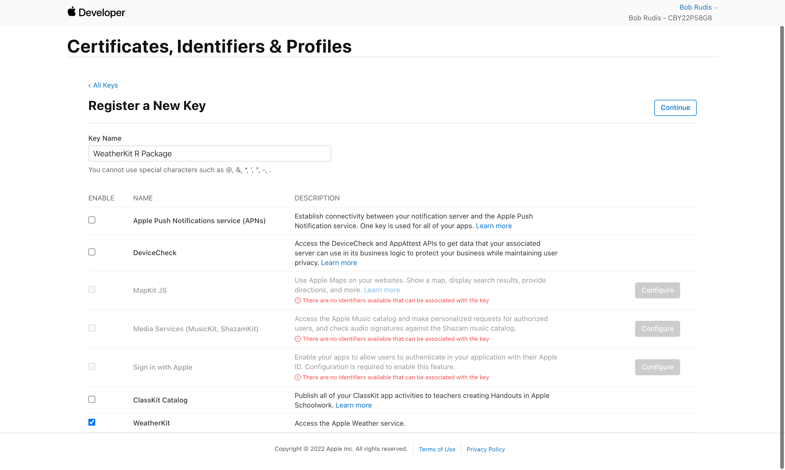
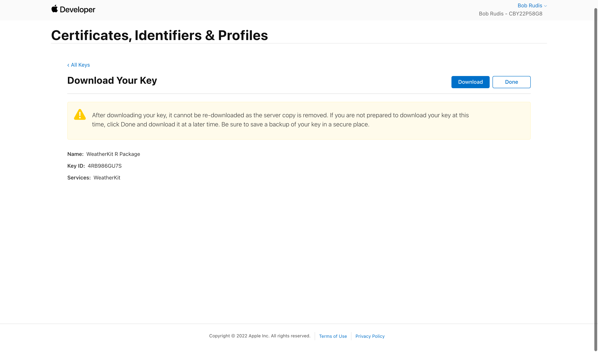
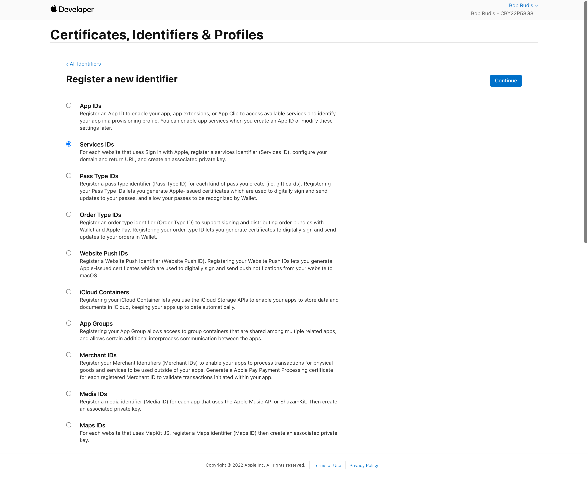
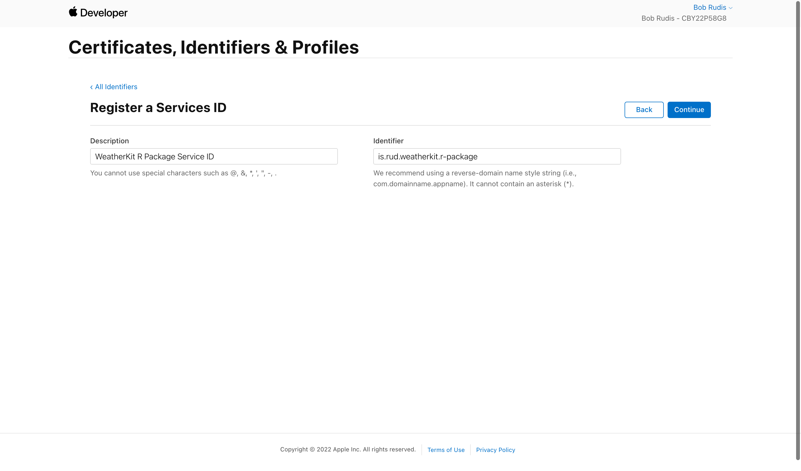

WeatherKit REST API Authorization
================

You will need an [Apple Developer Account](https://developer.apple.com)
to use the WeatherKit REST API. Once you create an account, or already
have an account, there are some steps you need to take in order to
properly authenticate to the WeatherKit REST API. The steps are provide
in the [Apple WeatherKit REST API
documentation](https://developer.apple.com/documentation/weatherkitrestapi/request_authentication_for_weatherkit_rest_api)
and below.

First, make note of your team idenfitier which is the 10-character
string that can be found at
<https://developer.apple.com/account/#!/membership/>. Mine is
`CBY22P58G8`.

Next, head over to
<https://developer.apple.com/account/resources/authkeys/add> and create
a WeatherKit key by providing a key name and selecting “WeatherKit” from
the available services:

<!-- -->

You will need to make note of the key identifier (in this case,
`4RB986GU7S`) and download the private key file.

<!-- -->

Make note of the path and filename where you store it and ensure to keep
it secret (i.e. never store in git repositories). This is the only real
secret you need to keep for the whole process.

Next, head over to
<https://developer.apple.com/account/resources/identifiers/add/bundleId>
and create a service identifier, by selecting “Service IDs” and
selecting “Continue”:

<!-- -->

In the next page, enter a description for the service id and an
identifier. I used `is.rud.weatherkit.r-package`

<!-- -->

You now have what you need to authenticate and start using this package.

A `wxkit_auth()` function is provided to assist in using the various
authentication and signing components with the WeatherKit REST API. The
function takes the following parameters and looks for them in the
corresponding environment variables.

| auth/sign parameter |    environment variable |                              my value |
|--------------------:|------------------------:|--------------------------------------:|
|            `key_id` |     `WEATHERKIT_KEY_ID` |                          `4RB986GU7S` |
|        `service_id` | `WEATHERKIT_SERVICE_ID` |         `is.rud.weatherkit.r-package` |
|           `team_id` |    `WEATHERKIT_TEAM_ID` |                          `CBY22P58G8` |
|  `private_key_path` |   `WEATHERKIT_KEY_PATH` | `~/.auth/wxkit/AuthKey_4RB986GU7S.p8` |

These components are all used to [JSON Web Tokens](https://jwt.io) which
are used to securely request service data.

You can view the usage of your WeatherKit service at
<https://developer.apple.com/account/resources/services/weatherkit>.

As of 2022-07-03, Apple’s WeatherKit provides up to 500,000 API calls a
month per Apple Developer Program membership. If you need additional API
calls, monthly subscription plans will be available for purchase
sometime after the beta is officially over. This is the expected
pricing:

-   500,000 calls/month: Included with membership
-   1 million calls/month: US$ 49.99
-   2 million calls/month: US$ 99.99
-   5 million calls/month: US$ 249.99
-   10 million calls/month: US$ 499.99
-   20 million calls/month: US$ 999.99
